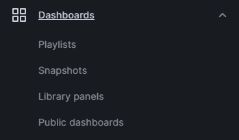
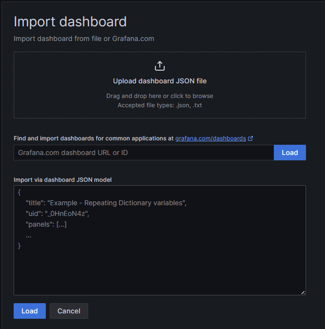
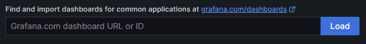
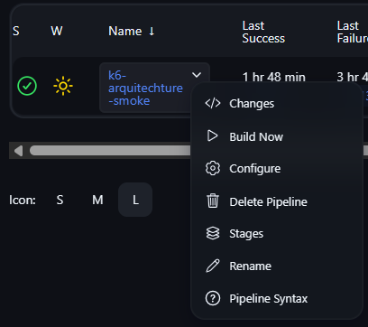

<p align="center">
  
</p>

<div align="center">

# 🚀 Testes de Performance com Arquitetura Escalável e Modular

[](https://k6.io/)
[](https://prometheus.io/)
[](https://grafana.com/)
[](https://www.jenkins.io/)
[](https://www.docker.com/)
[](https://git-scm.com/)

</div>

Este projeto demonstra uma arquitetura de testes de performance completa, utilizando **K6** para execução, **Prometheus** para coleta de métricas e **Grafana** para visualização, tudo orquestrado por uma pipeline **Jenkins** em um ambiente Docker.


<h3>✨ Contribuidores</h3>
<br>
<table border="0">
  <tr>
    <td align="center">
      <a href="https://github.com/Batissta">
        <br>
        <sub>
          <b>Francinaldo Batista</b>
        </sub>
      </a>
    </td>
    <td align="center">
      <a href="https://github.com/marcoscastroj">
        <br>
        <sub>
          <b>Marcos Castro</b>
        </sub>
      </a>
    </td>
    <td align="center">
      <a href="https://github.com/nathreginavt">
        <br>
        <sub>
          <b>Nathália Teixeira</b>
        </sub>
      </a>
    </td>
    <td align="center">
      <a href="https://github.com/viitoriamoreirac">
        <br>
        <sub>
          <b>Vitória Cabral</b>
        </sub>
      </a>
    </td>
  </tr>
</table>


### 🔧 Binários xK6 Utilizados

Para estender as funcionalidades do K6, o projeto utiliza os seguintes binários customizados:

- [**xK6 Faker**](https://github.com/grafana/xk6-faker): Para gerar dados de teste dinamicamente.
- [**xK6 Prometheus**](https://github.com/grafana/xk6-output-prometheus-remote): Para enviar métricas de performance para o Prometheus.

---

### 📦 Início Rápido com Docker

Siga estes passos para configurar e executar o ambiente de testes.

1.  **Construa a imagem customizada do Jenkins:**
    ```bash
    docker build -t jenkins-golang-xk6-prometa .
    ```
2.  **Execute o contêiner Jenkins:**
    ```bash
    docker run -d -p 8080:8080 -p 50000:50000 -v jenkins_home:/var/jenkins_home --name jenkins-master jenkins-golang-xk6-prometa
    ```
3.  **Inicie a stack de monitoramento (Prometheus + Grafana):**
    ```bash
    docker compose up -d
    ```

---

### ⚙️ Configurando o Jenkins

Acesse a interface do Jenkins em `http://localhost:8080`.

1.  **Login Inicial**: Siga as instruções para realizar o primeiro login. A senha de administrador inicial pode ser encontrada nos logs do seu contêiner Jenkins.
2.  **Criar a Pipeline**: No Jenkins, crie um novo item do tipo **Pipeline**.
    - **Nome**: `k6-smoke`
    - **URL do Repositório**: `https://github.com/Batissta/k6-performance-testing.git`
    - **Caminho do Jenkinsfile**: `ci/smoke/Jenkinsfile`

---

### 🚦 Preparando o Ambiente de Teste

Para que os testes se conectem à sua aplicação, é necessário que sua API esteja em execução no endereço `http://localhost:3333`.

- A pipeline do Jenkins foi configurada para passar a variável de ambiente `--env BASE_URI=http://host.docker.internal:3333`, direcionando o tráfego do contêiner de testes para a sua máquina local.
- Se sua API não estiver em execução localmente, altere a `BASE_URI` no arquivo de configuração do seu projeto para o endereço correto.

---

### 📊 Configurando o Dashboard no Grafana

Acesse o Grafana em `http://localhost:3000` para visualizar as métricas.

1.  **Adicione a Fonte de Dados Prometheus**:

    - Clique em **"Connections"** e depois em **"Add new data source"**.
    - Procure e selecione **`Prometheus`**.
    - No campo **URL**, adicione: `http://prometheus:9090`
    - Salve e teste a conexão.

2.  **Importe um Dashboard**:

    - Busque por templates no [site oficial do Grafana](https://grafana.com/grafana/dashboards/) (preferencialmente modelos para Prometheus + K6).
    - Copie o ID do dashboard escolhido.
    - No menu lateral do Grafana, navegue para **"Dashboards"** e clique em **"Import"**.

    

    Nessa nova página, clique para criar um novo dashboard e clique em importar um dashboard.<br>

    _Você deve se encontrar nesta página_<br>
    <br>

    O id do seu dashboard, deve ser colocado nesse campo<br>
    <br>
    Agora, clique em **Load**, selecione o **data source** que você criou anteriormente e **importe o dashboard**.

---

### 🚀 Executando e Verificando

1.  **Execute a Pipeline**: No Jenkins, vá para a pipeline `k6-smoke` e clique em **"Build Now"**.
    

2.  **Verifique os Dados**: Após a execução, os dados começarão a aparecer no seu dashboard do Grafana em `http://localhost:3000`.

---

### 📁 Estrutura do Projeto

```
└── batissta-k6-performance-testing/
    ├── readme.md
    ├── docker-compose.yml
    ├── Dockerfile
    ├── prometheus.yml
    ├── ci/
    │   ├── endurance/
    │   │   └── Jenkinsfile
    │   ├── load/
    │   │   └── Jenkinsfile
    │   ├── smoke/
    │   │   └── Jenkinsfile
    │   └── stress/
    │       └── Jenkinsfile
    ├── config/
    │   ├── login/
    │   │   └── .gitkeep
    │   └── signUp/
    │       ├── signUp.js
    │       └── signUpGrafana.js
    ├── data/
    │   ├── dynamic/
    │   │   └── signUpDatapool.js
    │   └── static/
    │       └── .gitkeep
    ├── simulation/
    │   └── signUp.js
    ├── support/
    │   ├── base/
    │   │   ├── checks.js
    │   │   ├── constants.js
    │   │   ├── environment.js
    │   │   ├── imports.js
    │   │   └── metrics.js
    │   ├── libs/
    │   │   └── .gitkeep
    │   └── services/
    │       ├── baseRest.js
    │       └── requests/
    │           ├── loginRequest.js
    │           └── signUpRequest.js
    └── tests/
        ├── enduranceTests.js
        ├── loadTests.js
        ├── smokeTests.js
        └── stressTests.js
```

<br>
<br>
<br>
<br>
<br>
<br>
<br>

_Documentação criada por [Francinaldo Batista.](https://github.com/Batissta)_
